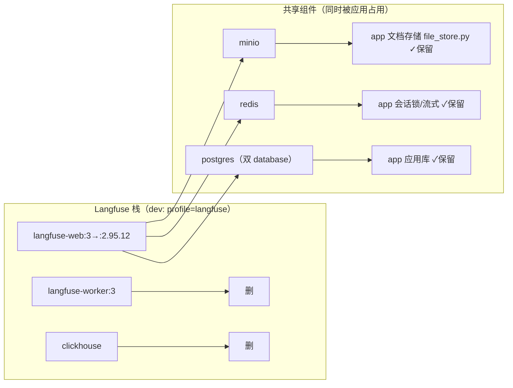

## Context

当前自托管可观测后端是 Langfuse v3，由六个组件构成：`langfuse-web:3` + `langfuse-worker:3` + ClickHouse + Redis + MinIO(S3) + PostgreSQL。项目自己的存储按 ADR-0004 已收敛为一个 PostgreSQL 实例、两个 database（应用 + Langfuse）。

两份 compose 的 profile 形态不一致：

| | dev (`docker-compose.yml`) | prod (`docker-compose.prod.yml`) |
|---|---|---|
| profile 门 | langfuse 栈挂 `profiles: ["langfuse"]`（`:63/115/159`），默认**不启动** | **无任何 `profiles:`**，全服务默认**启动** |
| clickhouse `mem_limit` | 256m | 8g |
| langfuse-worker / web | 256m / 256m | 2g / 2g |

**本仓对 Langfuse 的真实在用面**（一手，见 `docs/tmp/deep-research-langfuse-postgres-only.md` §8）：

- prompt 管理是唯一在用能力，且走 HTTP 直连 `/api/public/v2/prompts/{name}`（不过 SDK）；
- 但该能力已按 **ADR-0010 出列**——`.env` 中 `LANGFUSE_ENABLE=false`，运行时走本地兜底；
- tracing **未接线**：`@traced` 无应用点、`self._tracer` 无调用 → 当前不产出 trace；
- 无 score / dataset / 多模态 / OTel。

**已成立的兼容前提**：`pyproject.toml:21` 已是 `langfuse>=2.60.0,<3.0.0`（Python SDK v2）；官方矩阵中 SDK v2 在 OSS v2 服务端为 **Full** 支持；`/api/public/v2/prompts` 端点存在于 v2 线（已核对源码 tag `v2.95.12` 的代码树；该 tag **无 Docker 镜像 tag**，见 D10#1）。→ **切 v2 不需要改 `src/` 任何代码。**

**约束**：测试机约 3.8 GB（WSL）；生产单 worker；文档一事一档。

## Goals / Non-Goals

**Goals:**

- 用 Langfuse v2 替换 v3，使可观测后端只需「一个 web 容器 + 既有 PostgreSQL」，不再需要 ClickHouse / worker / 供 Langfuse 用的 S3。
- 保住 Langfuse 的 UI 与「将来可升级」的通道，作为小公司的最小可用形态。
- dev 本地开箱即用（默认启用），且可一键关闭。
- 收敛 EOL 版本的暴露面。

**Non-Goals:**

- **不做** v2 → v3/v4 的升级（另案，走独立分支）。本变更只保证升级通道不被堵死，不实现迁移。
- **不做** tracing 接线（`@traced` / `current_tracer` 的启用）。**另案处理，本次不创建 change**，待后续重新评估；注意它一旦接线即引入真实 trace 写入，届时必须一并落地 trace 保留/清理（见 D7 残留）。
- **不改** `src/`、`tests/`、`pyproject.toml`。
- **不删** MinIO / Redis / PostgreSQL —— 它们不是 Langfuse 专属（见 D2）。
- **不**把 prod 指向托管 RDS（另案）。

## Decisions

### D1：服务端退到 v2 线（锁定 `2.95.11`），而非其它三条路

| 方案 | 取舍 | 结论 |
|------|------|------|
| **① v3 → v2 线（锁 `2.95.11`）** | 甩掉 ClickHouse 与 worker；代价是 EOL 与升级锁 | **选** —— 小公司最低可用性优先；**规模未评估**（见下方注 D1-note） |
| ② 整体去掉 Langfuse | 最干净、服务归零（prompt 已出列、tracing 未接线）；但放弃 UI 与未来 trace 能力 | 否决：用户明确要保留 Langfuse |
| ③ v3/v4 + 托管 ClickHouse | 消掉"自建"但没消掉 ClickHouse 本身，仍是第二个存储服务 | 否决：不解决"多一套资源"的诉求 |
| ④ 换 PG-only 方案（Phoenix / MLflow 3） | 真正 PG-only | 否决：换产品、迁移成本，非本期目标 |

官方**没有** v3→v2 的降级路径（只有 v2→v3 升级指南，且明写"较新的 v3 会移除 v2 仍依赖的数据库实体"）。因此本变更是**非常规操作**，D4 的库重建是其直接后果。

**D1-note：关于「PostgreSQL 能否撑住 trace」——本变更不主张任何量级。** 当前部署不产出 trace（`@traced` 无应用点），该问题在当前是空的。且先前调研正好指出 v3 引入 ClickHouse 的原因就是 Postgres 扛不住 trace 写入/OLAP 负载（`docs/tmp/deep-research-langfuse-postgres-only.md` §2.3）。**规模是否成立，必须在接线 tracing 并有真实负载后重新评估**；在此之前任何量级数字都属未经验证的推断。

### D2：只删 `clickhouse` 与 `langfuse-worker`，其余三个组件保留

**关键判断：MinIO 不是 Langfuse 专属**——应用通过 `src/infra/db/file_store.py` 用它存文档（`MINIO_DOC_BUCKET`）。Redis 是应用会话锁/流式状态的载体。PostgreSQL 是应用库。**只有 ClickHouse 与 worker 是纯 Langfuse v3 组件。**

### D3：compose 锚点随 worker 删除而取消（改为内联）

`&langfuse-env` 与 `&langfuse-depends` 原本定义在 `langfuse-worker` 上（dev `:117`/`:124`，prod `:117`/`:123`），由 `langfuse-web` 用 `*langfuse-depends` / `<<: *langfuse-env` 引用。**删除 worker 后 `langfuse-web` 成为唯一消费者**，而 YAML 不允许同一 mapping 内既定义 `&anchor` 又 `<<: *anchor` 自引用（实测 `compose config` 报 `exceeds maximum node visit limit`）→ 把两者的内容**直接内联**进 `langfuse-web`，不再保留锚点。删 worker 后 `depends_on` 只留 `postgres(service_healthy)`。

> **实施偏离（已记明）**：原计划写的是"把锚点定义**迁到** `langfuse-web`，否则 compose 校验失败"。严格说**迁移可行**（把锚点提到顶层 `x-langfuse-env: &langfuse-env` 再在服务内 `<<: *langfuse-env`，实测解析正常），所以"否则校验失败"的立论过强。**单消费者下内联更简**（少一层间接、语义不变），故采用内联。

### D4：旧库直接 drop 重建

- **理由**：Langfuse database 当前是 v3 的 Prisma schema。Prisma 迁移**单向、无 downgrade**，v2 的 `migrate deploy` 无法在 v3 迁移历史上运行。唯一可行路径是重建空库，让 v2 从零迁移。
- **数据损失可接受**：prompt 已出列（ADR-0010）、tracing 未接线、无 score/dataset → Langfuse 侧无在用数据。
- **操作边界**：只重建单个库，且连**维护库**执行 —— `psql -U langfuse -d postgres -c "DROP DATABASE langfuse WITH (FORCE);"` → `-c "CREATE DATABASE langfuse OWNER langfuse;"`（见 Migration Plan 步骤 3）。**禁止** `docker compose down -v` / `docker volume prune`——那会连带毁掉应用库与应用数据（compose 头部已有此禁令）。
- **重建后**：靠 `LANGFUSE_INIT_*` 重新初始化 org/project/user，并**经 `LANGFUSE_INIT_PROJECT_ID` + `LANGFUSE_INIT_PROJECT_PUBLIC_KEY`/`SECRET_KEY` 播种既有 key** —— `.env` 那对 key 继续有效，**无需重新签发**（见 D9#1；spec「凭据连续性」）。

### D5：暴露面收敛到回环

v2 为 EOL，不应对外可达。dev 的 `3000:3000` 改为 `127.0.0.1:3000:3000`（prod 已是回环）。本地调试不需要对外网卡绑定，成本为零。

### D6：保留 profile，用 `COMPOSE_PROFILES` 实现默认启用

带 `profiles:` 的服务**默认不启动**，所以"保留 profile + 默认开启"无法只靠 `profiles:` 表达。采用：dev 的 `profiles: ["langfuse"]` **原样保留**，在 `.env` 加 `COMPOSE_PROFILES=langfuse`。这样 `docker compose up -d` 默认起，且置空该变量即可关闭。prod 本无 profile 门，天然默认起，无需改动。

### D7：trace 保留/清理**不在本次范围**（用户 2026-09-21 决定）

Langfuse 的 Data Retention 在自托管下属**企业版功能**；OSS v2 的环境变量表中没有任何 retention/cleanup 开关。因此本次**不设**「保留有界」的 spec 要求，也不引入外部清理脚本。两项理由：① 本次不接线 tracing，Langfuse 当前不产出 trace，该要求是空的；② 清理机制本身需要一次独立设计（自建定时清理 vs 其它），属另一议题。**后续 change 处理**：在接线 tracing 的那次变更里一并确定保留窗口与清理方式。

> **残留（显式接受）**：一旦 tracing 接线而清理尚未落地，Langfuse 库中的 trace 将**无界增长**。这是一个已知的过渡状态，其处理时点绑定在 tracing 接线的变更上。

### D8：本轮确认的边界决定（用户 2026-09-21）

| # | 决定 | 说明 |
|---|------|------|
| 1 | 镜像 tag 回退口径 → **已被实测取代**（见 D10#1） | 实测 `2.95.12` **没有 Docker tag**；改为锁定 **`2.95.11`** |
| 2 | dev 端口**收敛到回环** | `3000:3000` → `127.0.0.1:3000:3000`（见 D5） |
| 3 | 重建后的 API Key：~~不重签~~ → **改为保留** | **已被 D9#1 取代**。取证发现 v2 支持 `LANGFUSE_INIT_PROJECT_PUBLIC_KEY`/`SECRET_KEY` 直接指定 key，故不必让旧 key 失效 |
| 4 | minio 启动命令**去掉** `mkdir -p /data/langfuse` | v2 不再需要 S3 事件存储，该目录成为死物（应用仍用 `documents` bucket，minio 本身保留） |
| 5 | `.env.template` 漂移**本次一并补齐** | 补 `LANGFUSE_INIT_*` / `LANGFUSE_ENCRYPTION_KEY` / `NEXTAUTH_URL`。重建后正是靠 `LANGFUSE_INIT_*` 重建组织/项目/管理员，模板缺它会让照模板部署者得到不可登录的 UI |
| 6 | tracing 接线**另案** | 本次不创建 change，后续重新评估（见 Non-Goals） |

### D9：取证后的新决定（用户 2026-09-21；事实来自官方源码 + 本机实测）

**取证改变了设计**：其中 D9#1、D9#2 是**实质性**的，其余是验收口径。

| # | 决定 | 依据 |
|---|------|------|
| 1 | **用 `LANGFUSE_INIT_PROJECT_PUBLIC_KEY`/`SECRET_KEY` 播种，保住现有凭据** | 官方 v2 的 `.env.prod.example` 存在 `LANGFUSE_INIT_PROJECT_{ID,PUBLIC_KEY,SECRET_KEY}`（值形如 `pk-lf-…`/`sk-lf-…`），即 key 可经环境变量直接指定。于是库重建后 `.env:46-47` 那对 key **继续有效**，无需在 UI 里重取。**gotcha（官方）**：compose 里这些值**不要加双引号** |
| 2 | **显式设 `HOSTNAME=0.0.0.0`** | 取证确认 v2 的 `HOSTNAME` **默认 `localhost`**（官方 env 表与 `.env.prod.example`），而 Next.js standalone 默认绑回环。故这不是"待验证"而是**必设**——否则 `app` 无法经 `langfuse-web:3000` 访问，一旦开启远端/tracing 会静默走兜底 |
| 2b | **播种依赖 `LANGFUSE_INIT_PROJECT_ID`** | 官方 v2.95.12 的 `web/src/initialize.ts` 把 project 与 key 的创建整体嵌在 `if (env.LANGFUSE_INIT_PROJECT_ID)` 内；`*_NAME` 只作展示名、不参与匹配。**缺 PROJECT_ID 时 project 与 key 都不建且不报错** → 已写成 spec 的负例场景 |
| 3 | **验收必须含一条端到端写入冒烟** | 本变更完成后后端是**空转**的（tracing 未接线、prompt 走本地兜底），UI 里不会有数据，故"可用"不能用"有数据"证明。改为：用现有 `LangfuseTracer` 裸发一条 trace（不经应用路径、不改 `src/`），在 UI 确认可见后丢弃（task 6.9） |
| 4 | **退役资源直接删，不留回退**；范围含非 Langfuse 的孤儿卷 | 用户明确要求直接删并"看到了就处理"。本机实测四个卷 `LINKS=0`：`corporate_rag_clickhouse_data`(439MB)、`corporate_rag_chroma_data`(815kB)、`corporate_rag_chroma_onnx_cache`(0B)、`financial_qa_app_logs`(0B)。**严禁**触碰 `corporate_rag_app_logs`（正被 app 挂载）与 `postgres_data`/`redis_data`/`minio_data`。另删 minio 的 `langfuse` bucket（v2 不用 S3） |
| 5 | **prod 以静态校验验收** | prod 从未部署过 v3，`docker-compose.prod.yml` 无运行环境可验。改为 `docker compose -f docker-compose.prod.yml config` + 与 dev 逐项同构对照，并在 ADR 记明"prod 侧未运行验证" |
| 6 | **全量测试要求收窄** | 本变更不改 `src/`/`tests/`，且测试机 DB 用例历史报 `gaierror`（环境问题）。改为"`ruff`/`pyright` 无新增 + 全量结果与改动前逐项一致"，不要求绝对全绿 |
| 7 | 服务名保持 `langfuse-web`；`NEXTAUTH_URL` 不动；不设 `LANGFUSE_ENABLE_EXPERIMENTAL_FEATURES` | 官方 v2 compose 的服务名叫 `langfuse-server`，但我们的 `LANGFUSE_HOST` 依赖 `langfuse-web` 这个网络别名，改名无益；`.env:56` 已是 `http://localhost:3000`，正是回环部署下"可被浏览器解析"的对外地址（v2 要求的是对外地址，**不是**容器名）；`EXPERIMENTAL_FEATURES` 与本项目用不到的功能相关 |

### D10：镜像来源与拉取通道（2026-09-21 实测；**取代 D8#1**）

| # | 事实 / 决定 | 证据 |
|---|------------|------|
| 1 | 目标镜像锁 **`langfuse/langfuse:2.95.11`** | 实测 `2.95.12` **无 Docker tag**（404；官方只发了 GitHub release）；浮动 `:2` 解析为 **`2.95.11`**；`2.95.11` 是独立可锁 tag。linux/amd64 平台清单摘要 `sha256:e7aafd3ccf721821b40f8b2251220b4bb8af5e4877b5c5a8846af5b3318aaf1d`（需要完全可复现时用它） |
| 2 | **无需自建镜像、无需中转机**：本机 `docker pull` 直接用 | 端到端实测 `docker pull busybox:1.36` **成功**，而直连 `registry-1.docker.io` 不通 → 必然走 `/etc/docker/daemon.json` 的加速器。**前置依赖**：3 个加速器（daocloud / 1ms.run / xuanyuan.me）是 Hub 拉取的命脉；`auth.docker.io` 不通，鉴权靠加速器自带端点——实测 daocloud(`m.daocloud.io/auth/token`) 与 1ms.run(`.../openapi/v1/auth/token`) 可用，**xuanyuan.me 返回 403、疑似不可用** |
| 3 | **prod 的 MinIO 引用已失效，本次顺带修** | `docker-compose.prod.yml:88` 的 `minio/minio:latest` 实测 **404（上游已删镜像）**：MinIO 2025.06 删 Web UI → 2025.12 维护模式 → 2026.02 仓库停止维护 → **2026.09 删 Docker 镜像**，GitHub 已存档（最后版本 `RELEASE.2025-04-22T22-12-26Z`）。改为 dev 已在用的 `cgr.dev/chainguard/minio`（实测匿名可拉；容器内 MinIO `RELEASE.2026-06-04`，含 `sh`/`mc`/`minio`，无 `curl`）|
| 4 | **能力归属**：MinIO 镜像变更**不进** `observability-backend` 的 requirement | MinIO 服务的是**应用文档存储**，归 `document-upload-consolidation`；该能力只把 MinIO 当作 `FileStore` 的实现细节（spec 场景内一行），**没有镜像级 requirement** → 本次不产生它的 spec delta。按 `postgres-storage-consolidation` 的先例，作为「既有缺陷的顺带修复」记入 proposal 与 tasks |
| 5 | 遗留：MinIO 上游已死 | `cgr.dev/chainguard/minio` 是**第三方加固重建**；长期应另立议题换 S3 实现（Garage / RustFS / VersityGW / SeaweedFS 等），已登记进 ADR 复查条件（task 7.5⑤） |

## Risks / Trade-offs

- **[`2.95.11` 已属 EOL 线，无安全补丁承诺]** → 缓解：端口仅绑回环（D5）；不对外暴露；不承载公网流量。
- **[升级锁]** 未来升 v3/v4 需经 `v3.29.0` 中转、跨两个大版本，且 v2 期间累积的 trace **不会自动上行**（官方 v2→v3 是后台 PG→CH 搬运） → 缓解：明确接受"升级时丢弃历史 trace"，升级走独立分支（Non-Goal）；通道不被堵死即可。
- **[库重建时误伤应用数据]** → 缓解：只对单个 database 执行 DROP/CREATE；沿用 compose 头部对 `down -v`/`volume prune` 的禁令；操作前确认 `postgres_data` 卷不被触碰。
- **[v2 与本仓兼容性未实测]** → 缓解：SDK v2 与服务端 v2 为官方 Full 组合、HTTP prompt 端点存在于 v2 线（均有依据）；仍以实测为准（tasks 含验证步骤）。
- **[回滚成本高]** 切回 v3 需重新引入 CH/worker/S3，且库要重建成 v3 schema —— 实际是"重新部署 v3"，不是回滚 → 缓解：改动在独立分支，验证通过前不合入。
- **[dev 默认启用后测试机内存余量]** → 缓解：v2 仅一个 web 容器，且复用已有 PG；移除 ClickHouse 后净减两个容器，宿主侧总量仍下降。**dev `mem_limit` 由 `256m` 上调为 `512m`**（实测空载约 199 MiB，即 256m 下的 78%，余量不足 —— 原值是从旧 compose 抄来的未测量值，提案闸门未抓出，属计划侧缺陷）。
- **[先前调研明确"不建议上 v2.95.12"]** 调研（`docs/tmp/deep-research-langfuse-postgres-only.md` §9.4）主张"不建议为了只用 PG 而新上 EOL 的 v2"，优先"去掉 Langfuse / Phoenix / MLflow"。本变更**有据地推翻它**：Langfuse **不在请求路径上**——`LANGFUSE_ENABLE=false` + 本地兜底使 prompt 不依赖它，tracing 未接线且其唯一消费点 `rag/stream.py:stream_answer` 无任何调用方；因此"把 EOL 服务放进关键路径"这一核心反对意见在当前用法下不成立。→ **复查触发点**：Langfuse 首次被真正接入请求路径（prompt 远端读取开启，或 tracing 接线）时，重新评估本决策。
- **[v2 默认绑回环，跨容器不可达]** 已确认 v2 的 `HOSTNAME` 默认 `localhost`（即绑回环）→ `app` 无法经 `langfuse-web:3000` 访问，且失败是静默的（走本地兜底）。→ 缓解：**显式设 `HOSTNAME=0.0.0.0`**（D9#2；tasks 2.11 / 3.10），并以 task 6.8 验证。
- **[删除退役卷涉及非 Langfuse 资源]** D9#4 把清理范围扩到 `chroma_data` / `chroma_onnx_cache` / `financial_qa_app_logs`（更早的 Chroma 退役遗留），且用户要求不留回退。→ 缓解：删除前逐个用 `docker ps -a --filter volume=<name>` 复核 `LINKS=0`；**明确排除** `corporate_rag_app_logs`（正被 app 挂载）与 `postgres_data` / `redis_data` / `minio_data`。
- **[镜像拉取依赖本机加速器配置]** Hub 镜像的拉取命脉是 `/etc/docker/daemon.json` 的 3 个加速器（`auth.docker.io` 与 `registry-1.docker.io` 直连不通）。→ 缓解：把该前置写入部署文档；`xuanyuan.me` 实测 403，不要列入依赖。
- **[MinIO 上游已死，prod 曾引用已删镜像]** `minio/minio` 已 404；即便改用 `cgr.dev/chainguard/minio`，那也是**第三方加固重建**，且该 registry **不被国内加速器代理**、prod 机器能否直连未知。→ 缓解：prod 镜像本次修成 `cgr.dev/chainguard/minio`，并**按 index 摘要锁定**（dev 同锁同一摘要，见 ADR-0011；该 registry 无版本 tag，只能锁 digest）；把"换 S3 实现"登记为独立议题（task 7.5⑤）。

## Migration Plan

**两条硬约束 + 一条禁令**：① `stop` 必须按**容器名**执行，且先于任何 compose 改动（compose 一旦删掉 `langfuse-worker`/`clickhouse`，按服务名 `stop` 会报"未知服务"）；② `stop` 先于 `DROP DATABASE`（v3 worker 持有的 Prisma 连接会阻塞 DROP）。③ **在 `up -d` 之前必须完成步骤 1–5**——在"compose 已指向 v2 而库仍是 v3 schema"的中间态下 `up -d`，会让 v2 迁移失败并重启循环。禁令：不得 `docker compose down -v` / `docker volume prune`；**例外**是步骤 5 的定向 `docker volume rm`（已核实的孤儿卷）。

1. **停 v3 栈**：`docker stop corporate-rag-langfuse-web corporate-rag-langfuse-worker corporate-rag-clickhouse || true`（按容器名）。**本机实测这三个容器不存在**（该 profile 从未启用），故此步实为空操作。
2. **改配置**：两份 compose（镜像 tag、删 worker/clickhouse、锚点迁移、env 精简、`HOSTNAME=0.0.0.0`、`LANGFUSE_INIT_PROJECT_*`、端口回环、minio 命令）、`.env`/`.env.template`/`.env.example`、删 `deploy/clickhouse/`。
3. **重建库**：连**维护库**执行，避开"cannot drop the currently open database"（`langfuse` 角色的默认库正是待删的那个）：
   `docker compose exec postgres psql -U langfuse -d postgres -c "DROP DATABASE langfuse WITH (FORCE);"` → `-c "CREATE DATABASE langfuse OWNER langfuse;"`。`WITH (FORCE)` 用于终止任何残留连接（本机实测活跃连接数为 0）。
4. **清退役容器**：`docker rm corporate-rag-langfuse-worker corporate-rag-clickhouse || true`（本机本就不存在）。
5. **删退役资源**（用户决定：直接删，不留回退）：四个 `LINKS=0` 命名卷 —— `docker volume rm corporate_rag_clickhouse_data`(439MB) / `corporate_rag_chroma_data` / `corporate_rag_chroma_onnx_cache` / `financial_qa_app_logs`；并删 minio 的 `langfuse` bucket。**严禁**触碰 `corporate_rag_app_logs`（在用）、`postgres_data`、`redis_data`、`minio_data`。
6. **起服务**：`up -d`，确认 v2 迁移从零完成、无 schema/权限错误、UI 本机可访问。
7. **冒烟 + 验应用**：裸发一条 trace 并在 UI 确认可见（D9#3）；确认应用对话正常（`LANGFUSE_ENABLE=false` 走本地兜底）；确认 UI 中 project 仍持有 `.env` 那对 key（D9#1）。
8. **收尾**：新增 ADR；`code-map.md` 更新；两份旧分析文档标注被取代；`glossary.md` 登记术语。

**Rollback**：见 Risks——切回 v3 等价于重新部署 v3（且需重建库）。**步骤 5 删除 `clickhouse_data` 卷后，回退到 v3 的"数据面依据"也一并消失**（用户明确接受：不留回退）。风险控制靠"独立分支 + 验证通过前不合入"。

## Open Questions

**已解决（移出待决）**：prod 是否跑过 v3 → **从未部署**（用户确认 2026-09-21），故库丢失范围仅限 dev；trace 保留机制 → **不在本次范围**（见 D7）；v2 监听地址 → **必须设 `HOSTNAME=0.0.0.0`**（D9#2）；`NEXTAUTH_URL` → `.env:56` 的 `http://localhost:3000` 即正确值，无需改（D9#7）；重建后 API Key → **经 `LANGFUSE_INIT_PROJECT_*` 保留**（D9#1）；**镜像版本与拉取通道 → 已实测结案（D10#1/#2）：锁 `2.95.11`，本机 `docker pull` 可直接拉**（此前的"Hub 不可达"仅对浏览器成立）。

1. **dev 默认启用后的内存余量**：测试机 3.8 GB 下是否足够？（由 tasks 6.6 实测回答）
2. **prod 机器能否直连 `cgr.dev`**：该 registry 不被国内加速器代理；prod 未部署过，无环境可验。**建议**：真部署时先 `docker pull cgr.dev/chainguard/minio:<tag>` 试一次；不通则要么走内网 registry，要么另选镜像源。
3. **（另案，不阻塞）`src/config/settings.py:305` 的 `LANGFUSE_HOST` 默认值仍是 `http://langfuse:3000`** —— 仓库内不存在该服务名。因 `.env:48` 覆盖了它，当前无运行时影响，但属与本轮 `.env.template` 同类的漂移。**建议**：本次不碰（维持"`src/` 零改动"的边界），已登记进 ADR 复查条件（task 7.5④）。
